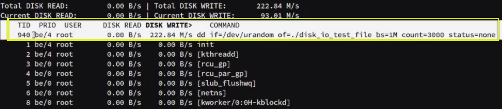

# Disk Performance Issue:


```sh
apt install sysstat
sar
uname -a
cat /etc/os-release
uptime # Check Load Average
cat /proc/cpuinfo # Check CPU information
cat /proc/meminfo # Check memory information
top
```
```sh
sar 1 # Run every seconds
sar 1 # Check CPU (more IOWait => CPU is engaged with IO)
sar -b 1 # Check Blocks
```
* `tps` : Transaction p/s
* `rtps` : read p/s
* `wtps` : write p/s
* `bread/s` : Block read p/s
* `bwrtn/s` : Block write p/s
```sh
sar -b -d 1 # Check per disk
sar -n TCP 1 # Check Network
ss -ltnp # Check ports
iotop # Check I/O
```

```sh
ps aux | grep -i dd # Show process of "dd"
```

```sh
ps auxf | less # Display process in tree view
```

```sh
ps aux | grep -i io.sh
```


