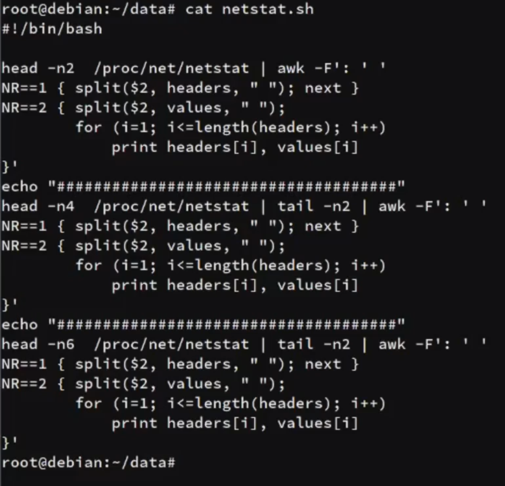

# Accept & SYN Queue in kernel and performance issue

```sh
ss -s # Display TCP states
cat /proc/net/sockstat
```
* `estab` : Established
* `closed`
* `orphaned` : Wait for respond
* `timewait`

```sh
ss -t
ss -tn
ss -tln
cat /proc/net/tcp # Hexadecimal mode
```

## netstat.sh Script:



```sh
#!/bin/bash

if [ "$1" == "netstat" ]
then
grep "TcpExt" /proc/net/netstat | awk -F': ' '
NR==1 { split($2, headers, " "); next }
NR==2 { split($2, values, " ");
        for (i=1; i<=length(headers); i++) 
            print headers[i], values[i]
}'
elif [ "$1" == "snmp" ]
then
grep "Tcp\:" /proc/net/snmp | awk -F': ' '
NR==1 { split($2, headers, " "); next }
NR==2 { split($2, values, " ");
        for (i=1; i<=length(headers); i++) 
            print headers[i], values[i]
}'
fi
```
```sh
bash netstat.sh | grep -E -i "overflow|drop"
watch -n1 -d "bash netstat.sh | grep -E -i 'overflow|drop'"
```

```sh
# Test sending requests concurrently:
ab -n 100000 -c 100 http://192.168.122.100/ 
watch -n1 -d "bash netstat.sh | grep -E -i 'syn|flow|drop' | grep -v '0$'" # Don't show 0 numbers
```
* `TCPTimeWaitOverflow` : There is a limitation & it has been overflowed
```sh
# Test again with more requests:
ab -n 100000 -c 1000 http://192.168.122.100/ 
```
> These values must be the same:
* `ListenOverflows` 
* `ListenDrops` 

### Queues:
* `SYN Queue` : TCP HandShake => SYN -> SYN ACK -> ACK -> Establish(Accepted)
* `Listen/Accept Queue` : After Establish state, the responsible service will work with this queue (like Nginx)

```sh
sysctl -a | grep -E -i "somax|syn_backlog"
net.core.somaxconn = 4096 # Accept Queue
net.ipv4.tcp_max_syn_backlog = 128
```
```sh
ss -ltnp # Display with PID
```
* `recv-Q` : Connections in Accept Queue
* `Send-Q` : Maximum connections in Accept Queue

### Change somaxconn value:
* `sysctl` : Kernel
* `Service` : Nginx

```sh
# Change limitation of net.core.somaxconn in Nginx:
vim /etc/nginx/sites-available/default
# Add this value to the first line :
listen 80 default_server backlog=8152
```

```sh
# Change limitation of net.core.somaxconn with sysctl:
sysctl -w net.core.somaxconn=8152
```


