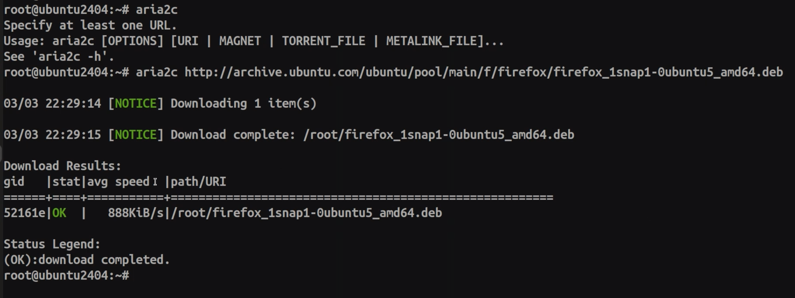

# 08-Install the Debian package with dpkg

### Debian Package Management:

```bash
dpkg -l # List all installed packages
dpkg -L InstalledPackage # List files & paths of installed package
dpkg -i Package.deb # Install package from local file. (Need dependencies)
dpkg -r Package # Remove installed package
dpkg -p Package # Remove and purge installed package
```

```bash
dpkg -C PackageFileName # Shows the content of the package
```


```bash
dpkg -s Package # Show status of installed package
```


```bash
dpkg -S File/Path # Shows which package this file or path belongs to
```


**Aria2c** -> Package Management Tool (Like wget)

```bash
aria2c PackageFileURL # Download Package file
```



