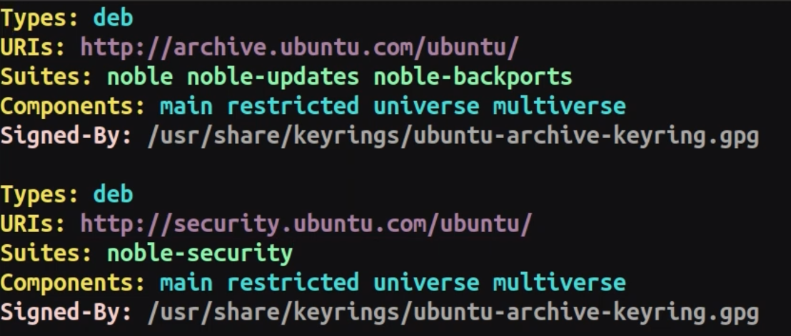

# 09-Install the Debian package with  APT

### Debian Package Management Tools:

`APT` , `Apt-get` , `Aptitude`

Repositories File Path:
```sh
/etc/apt/sources.list.d/ubuntu.sources
```


```bash
apt update # Update the list of last version of packages
apt list --upgradable # Get the list of upgradable packages
apt upgrade # Upgrade all packages
apt install PackageName # Install package
apt install Package1 Package2 Package3 # Install multi packages
apt remove PackageName # Remove packages
apt autoremove # Remove dependencies after removing a package
apt purge PackageName # Purge (remove) packages
apt-cache search PackageName # Search for a Package Name
apt-cache show PackageName # Get information of a package
apt-cache showpkg PackageName # List dependencies of a package
do-release-upgrade # Check & upgrade the OS version
```


