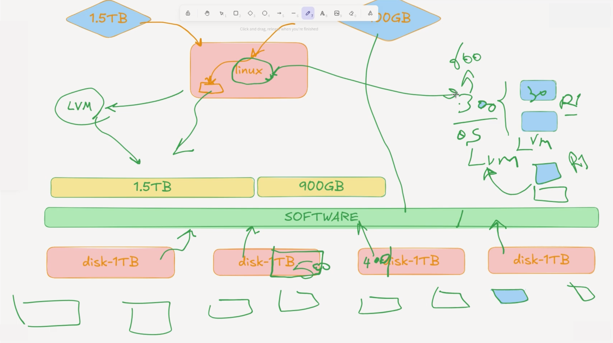
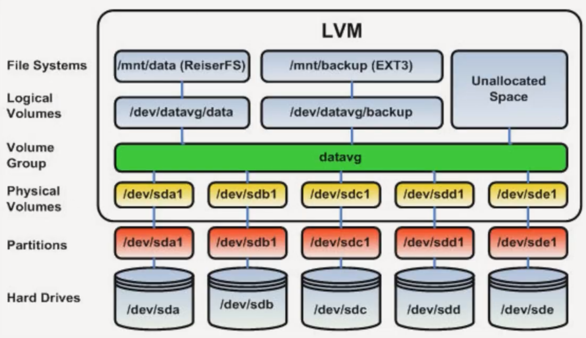

# 33-LVM (logical volume manager) Introduction



* `LVM` : Logical Volume Manager
* `PV` : Physical Volume (Physical Hard Disks)
* `VG` : Volume Group (Software Layer / Collection of Physical Volumes)
* `LV` : Logical Volume (A part or parts of a Volume Group)
*  



### Creating LVM with partitioning:

* Creating LVM partitions
* Creating Physical Volume
* Creating Volume Group
* Creating Logical Volume
* Making FileSystem
* Mounting


#### Creating LVM partitions:
```bash
fdisk /dev/sdb
fdisk /dev/sdc

Device     Boot Start      End  Sectors Size Id Type
/dev/sdb1        2048 62916607 62914560  30G 8e Linux LVM
/dev/sdc1        2048 62916607 62914560  30G 8e Linux LVM
```
```bash
root@server:~# lsblk
NAME                      MAJ:MIN RM  SIZE RO TYPE MOUNTPOINTS
sda                         8:0    0   60G  0 disk
├─sda1                      8:1    0    1M  0 part
├─sda2                      8:2    0    2G  0 part /boot
└─sda3                      8:3    0   58G  0 part
  └─ubuntu--vg-ubuntu--lv 252:0    0   29G  0 lvm  /
sdb                         8:16   0   50G  0 disk
└─sdb1                      8:17   0   30G  0 part
sdc                         8:32   0   50G  0 disk
└─sdc1                      8:33   0   30G  0 part
sr0                        11:0    1 1024M  0 rom
```

#### Creating Physical Volume:

* `pvdisplay` : Display physical volume details
* `pvs` : Report summary info about physical volumes
* `pvcreate` : Create physical volume
* `pvremove` : Remove a physical volume 
* `pvscan` : Scan all disks for physical volume
* `pvchange` : Activate, de-Activate physical volume
* `pvmove` : Move data from one pv to another pv
* `pvresize`
* `pvck`

```bash
root@server:~# pvcreate /dev/sdb1 /dev/sdc1

  Physical volume "/dev/sdb1" successfully created.
  Physical volume "/dev/sdc1" successfully created.
```

**pvdisplay:**
```bash
root@server:~# pvdisplay

  --- Physical volume ---
  PV Name               /dev/sda3
  VG Name               ubuntu-vg
  PV Size               <58.00 GiB / not usable 0
  Allocatable           yes
  PE Size               4.00 MiB
  Total PE              14847
  Free PE               7424
  Allocated PE          7423
  PV UUID               Yk9ySD-gUK5-twZy-7c1x-f0F0-9weP-nqdc4d

  "/dev/sdb1" is a new physical volume of "30.00 GiB"
  --- NEW Physical volume ---
  PV Name               /dev/sdb1
  VG Name
  PV Size               30.00 GiB
  Allocatable           NO
  PE Size               0
  Total PE              0
  Free PE               0
  Allocated PE          0
  PV UUID               PY1yde-H2WT-Gz6B-tVOq-kyVc-pp8K-Nks9NC

  "/dev/sdc1" is a new physical volume of "30.00 GiB"
  --- NEW Physical volume ---
  PV Name               /dev/sdc1
  VG Name
  PV Size               30.00 GiB
  Allocatable           NO
  PE Size               0
  Total PE              0
  Free PE               0
  Allocated PE          0
  PV UUID               CzIJzY-1Bpm-QuFR-m12M-xQX1-EJt6-pm4yl2
```

**pvs:**
```bash
pvs # Display summary of Physical Volumes

root@server:~# pvs

  PV         VG        Fmt  Attr PSize   PFree
  /dev/sda3  ubuntu-vg lvm2 a--  <58.00g 29.00g
  /dev/sdb1            lvm2 ---   30.00g 30.00g
  /dev/sdc1            lvm2 ---   30.00g 30.00g
```

**pvremove:**
```bash
root@server:~# pvremove /dev/sdb1 /dev/sdc1

  Labels on physical volume "/dev/sdb1" successfully wiped.
  Labels on physical volume "/dev/sdc1" successfully wiped.
```

#### Creating Volume Group:

* `vgdisplay` : Display volume group details
* `vgs` : Report summary info about volume groups 
* `vgscan` : Scans disk devices in the system looking for PV and VG
* `vgcreate` : Create a volume group 
* `vgextend` : Add a new PV to VG 
* `vgreduce` : Remove PV from VG
* `vgexport` : Export VG to system
* `vgimport` : Import VG from system
* `vgchange` : Activate VG, use "-a n" to deactivate
* `vgremove` : Remove VG from the system
* `vgrename` : Rename VG
* `vgsync` : Sync stale PE in VG

**vgcreate:**
```bash
root@server:~# vgcreate VG01_Data /dev/sdb1 /dev/sdc1

  Volume group "VG01_Data" successfully created
```

**vgdisplay:**
```bash
root@server:~# vgdisplay

  --- Volume group ---
  VG Name               VG01_Data
  System ID
  Format                lvm2
  Metadata Areas        2
  Metadata Sequence No  1
  VG Access             read/write
  VG Status             resizable
  MAX LV                0
  Cur LV                0
  Open LV               0
  Max PV                0
  Cur PV                2
  Act PV                2
  VG Size               59.99 GiB
  PE Size               4.00 MiB
  Total PE              15358
  Alloc PE / Size       0 / 0
  Free  PE / Size       15358 / 59.99 GiB
  VG UUID               eSZBIz-4Z0N-hK6v-qhrK-zkfN-Yokx-dCxaPB
```

**vgs:**
```bash
root@server:~# vgs

  VG        #PV #LV #SN Attr   VSize   VFree
  VG01_Data   2   0   0 wz--n-  59.99g 59.99g
  ubuntu-vg   1   1   0 wz--n- <58.00g 29.00g
```

**vgextend:**
```bash
vgextend VG01_Data /dev/sdd1 # Adding another PV to the VG
```

**vgreduce:**
```bash
vgreduce VG01_Data /dev/sdb1 # Remove one PV from the VG
```

**vgchange:**
```bash
vgchange -a y VG01_Data # Activate VG
vgchange -a n VG01_Data # Deactivate VG
```

#### Creating Logical Volume:

* `lvcreate` : Create logical volume
* `lvdisplay` : Display logical volume details
* `lvs` : show logical volume summary info
* `lvscan` : Scan for logical volumes
* `lvremove` : Remove logical volume
* `lvrename` : Rename logical volume
* `lvextend` : Increase size of logical volume
* `lvreduce` : Decrease size of logical volume
* `lvchange` : Active logical volume, use "-an" to Deactivate
* `lvsync` : Sync stale LE of logical volume
* `lvlnboot` : Set lv as root, boot, swap, dump volume

**lvcreate:**
```bash
root@server:~# lvcreate --name LV01_Data --size 40G VG01_Data

  Logical volume "LV01_Data" created.
```

**lvrename:**
```bash
lvrename /LV/Path NewLVName
lvrename /dev/VG01_Data/LV01_Data LV02_Documents
```

**lvdisplay:**
```bash
root@server:~# lvdisplay
  --- Logical volume ---
  LV Path                /dev/VG01_Data/LV01_Data
  LV Name                LV01_Data
  VG Name                VG01_Data
  LV UUID                E9Xsgw-XQ3H-rqA1-rho1-fYDY-bQ5b-8gQKB0
  LV Write Access        read/write
  LV Creation host, time server, 2025-06-13 13:11:37 +0000
  LV Status              available
  # open                 0
  LV Size                40.00 GiB
  Current LE             10240
  Segments               2
  Allocation             inherit
  Read ahead sectors     auto
  - currently set to     256
  Block device           252:1
```

**lvs:**
```bash
root@server:~# lvs

  LV        VG        Attr       LSize   Pool Origin Data%  Meta%  Move Log Cpy%Sync Convert
  LV01_Data VG01_Data -wi-a-----  40.00g
  ubuntu-lv ubuntu-vg -wi-ao---- <29.00g
```
```bash
root@server:~# lsblk

NAME                      MAJ:MIN RM  SIZE RO TYPE MOUNTPOINTS
sda                         8:0    0   60G  0 disk
├─sda1                      8:1    0    1M  0 part
├─sda2                      8:2    0    2G  0 part /boot
└─sda3                      8:3    0   58G  0 part
  └─ubuntu--vg-ubuntu--lv 252:0    0   29G  0 lvm  /
sdb                         8:16   0   50G  0 disk
└─sdb1                      8:17   0   30G  0 part
  └─VG01_Data-LV01_Data   252:1    0   40G  0 lvm
sdc                         8:32   0   50G  0 disk
└─sdc1                      8:33   0   30G  0 part
  └─VG01_Data-LV01_Data   252:1    0   40G  0 lvm
sr0                        11:0    1 1024M  0 rom
```
**lvreduce:**
```bash
lvreduce -L10G /dev/VG01_Data/LV01_Data # Reduce 10GB from the size of Logical Volume.
# WARNING: MAY DESTROY DATA
```

**lvresize:**
```bash
lvresize -L100G /dev/VG01_Data/LV01_Data # Resize the Logical Volume to 100GB.
lvresize -L+10G /dev/VG01_Data/LV01_Data # Increase the size of Logical Volume 10GB.
```

**lvextend:**
```bash
lvextend -L100G /dev/VG01_Data/LV01_Data # Resize the Logical Volume to 100 GB.
```


#### Making FileSystem:

```bash
mkfs.ext4 /dev/VG01_Data/LV01_Data
```

#### Mounting:

```bash
mount /dev/VG01_Data/LV01_Data /mnt
or
/etc/fstab # Find Volume Group ID /dev/disk/by-id/dm-uuid-lvm ...

root@server:~# ls -l /dev/disk/by-id/
total 0
lrwxrwxrwx 1 root root 10 Jun 13 11:42 dm-name-ubuntu--vg-ubuntu--lv -> ../../dm-0
lrwxrwxrwx 1 root root 10 Jun 13 13:11 `dm-name-VG01_Data-LV01_Data` -> ../../dm-1
lrwxrwxrwx 1 root root 10 Jun 13 11:42 dm-uuid-LVM-ozSGyXSleT7209Id7lavAG9mwqqmpdDOfvN6JaY1l2URedPBspHloKEBjIYtTSe7 -> ../../dm-0
lrwxrwxrwx 1 root root 10 Jun 13 13:11 `dm-uuid-LVM-eSZBIz4Z0NhK6vqhrKzkfNYokxdCxaPBE9XsgwXQ3HrqA1rho1fYDYbQ5b8gQKB0` -> ../../dm-1
lrwxrwxrwx 1 root root 10 Jun 13 12:35 lvm-pv-uuid-El7xlh-vc8U-NxZC-hSru-uEf0-s2UI-qluRyq -> ../../sdb1
lrwxrwxrwx 1 root root 10 Jun 13 12:35 lvm-pv-uuid-vxiZ1O-MCOb-9nIU-E91U-MZWV-BKrP-ma1rf8 -> ../../sdc1
lrwxrwxrwx 1 root root 10 Jun 13 11:42 lvm-pv-uuid-Yk9ySD-gUK5-twZy-7c1x-f0F0-9weP-nqdc4d -> ../../sda3
```
```bash
# /etc/fstab: static file system information.
#
# Use 'blkid' to print the universally unique identifier for a
# device; this may be used with UUID= as a more robust way to name devices
# that works even if disks are added and removed. See fstab(5).
#
# <file system> <mount point>   <type>  <options>       <dump>  <pass>
# / was on /dev/ubuntu-vg/ubuntu-lv during curtin installation
/dev/disk/by-id/dm-uuid-LVM-ozSGyXSleT7209Id7lavAG9mwqqmpdDOfvN6JaY1l2URedPBspHloKEBjIYtTSe7 / ext4 defaults 0 1
# /boot was on /dev/sda2 during curtin installation
/dev/disk/by-uuid/006d631a-140b-4696-a637-ccdcfeeb6290 /boot ext4 defaults 0 1
/swap.img       none    swap    sw      0       0
/dev/disk/by-id/dm-uuid-LVM-eSZBIz4Z0NhK6vqhrKzkfNYokxdCxaPBE9XsgwXQ3HrqA1rho1fYDYbQ5b8gQKB0 / ext4 defaults 0 1

~
```

### Creating LVM without partitioning:

* Creating Physical Volume
* Creating Volume Group
* Creating Logical Volume
* Making FileSystem
* Mounting

```bash
# Steps
pvcraete /dev/sdb
pvcreate /dev/sdc
pvs
vgcreate VG01 /dev/sdb /dev/sdc
vgs
lvcreate --name LV01 --size 40G VG01
lvs
mkfs.ext4 /dev/VG01/LV01
mount /dev/VG01/LV01 /mnt
/etc/fstab
```

#### LVM Snapshot:

```bash
lvcreate -s --size 100M --name LV01_Snap01 /dev/VG01/LV01 # Take Snapshot from Logical Volume state.

root@server:~# lvs
  LV        VG        Attr       LSize   Pool Origin Data%  Meta%  Move Log Cpy%Sync Convert
  ubuntu-lv   ubuntu-vg -wi-ao---- <29.00g
  LV01        VG01      -wi-a-----  40.00g
  LV01_Snap01 VG01      -swi-a-s--- 100.00m      LV01 0.01

umount /mnt
lvconvert --merg /dev/VG01/LV01_Snap01 # Restore the snapshot of Logical Volume.

root@server2:~# lvconvert --merg /dev/VG01/LV01_Snap01 
  Merging of volume LV01_Snap01 started.
  LV01: Merged: 100.0%

mount /dev/VG01/LV01 /mnt
```


