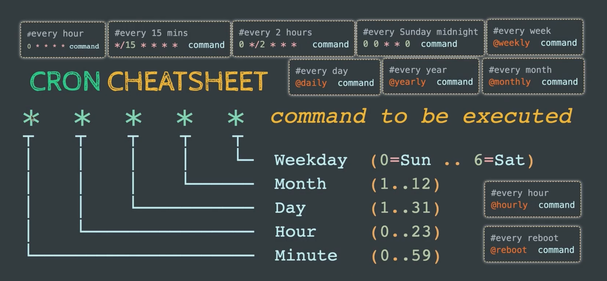

# 44-Cron



### Schedule Jobs:

> Linux systems have two facilities for scheduling jobs to run at regular intervals:

* The original `cron` facility is best suited to servers and systems that are continuously powered on.
* The `anacron` (or `anachronistic cron`) facility is suited to systems such as desktops or laptops that can be asleep or running on battery power.

| cron                                                 | anacron                                |
| ---------------------------------------------------- | -------------------------------------- |
| Good for servers                                     | Good for laptops and desktops          |
| Granularity from one minute to one year              | Daily, weekly, and monthly granularity |
| Job runs only if system is running at scheduled time | Job runs when system is next available |
| Can be used by normal users                          | Needs root authority                   |


**Cron Job Parameters:**
```bash
* * * * * command(s)
- - - - -
| | | | |
| | | | ----- Day of week (0 - 7) (Sunday=0 or 7)
| | | ------- Month (1 - 12)
| | --------- Day of month (1 - 31)
| ----------- Hour (0 - 23)
------------- Minute (0 - 59)
```

* `*` : Means any value or always.
* `,` : To specify a list of values for repetition. 
* `-` : To specify a range of values. (18-23)
* `/` : To specify values that will be repeated over a certain interval between them.

* `@reboot` : After Reboot
* `@hourly` : Every Hour
* `@daily` : Every Day
* `@weekly` : Every Week
* `@monthly` : Every Month
* `@yearly` : Every Year

```bash
@reboot        # On reboot
50 13 * * *    # 1:50 PM daily
40 6 4 * *     # 4th of every month at 6:40AM
05 * * 1 0     # 5 minutes past every hour,each Sunday in January
0 15 29 11 5   # 3:00PM Every November 29th  that lands on a Friday
1,5,10 * * * * # 1,5,10 minutes past every hour
30 20 * * 1-5  # Weekdays at 8:20 PM
*/5 * * * *    # Every 5 minutes
* */2 * * *    # Every 2 hours
* * */3 * *    # Every 3 days
* * * */4 *    # Every 4 month
```

### CronTab:

> `Crontab` (cron table) is a text file that specifies the schedule of cron jobs. The `cron` daemon wakes up every minute and checks each crontab for jobs that need to run. 
> There are two types of crontab files.  The  individual user crontab files and  system-wide crontab files.

**User-Level Crontab Path:**

* In Debian/Ubuntu : `/var/spool/cron/crontabs`
* In RedHat/CentOs : `/var/spool/cron`

**Crontab Command:**

```bash
crontab -e # Edit crontab file, or create one if it doesn’t already exist.
crontab -l # Display crontab file contents.
crontab -r # Remove your current crontab file.
crontab -i # Remove your current crontab file with a prompt before removal.
crontab -u UserName # Edit other user crontab file. Requires system administrator privileges.
```

```bash
user1@ubuntu:~# crontab -e

no crontab for user1 - using an empty one
Select an editor.  To change later, run 'select-editor'.
  1. /bin/ed
  2. /bin/nano        <---- easiest
  3. /usr/bin/vim.basic
  4. /usr/bin/vim.tiny
Choose 1-4 [2]: 3
```
```bash
# Example:
0 5 * * 1 tar -zcf /var/backups/home.tgz /home/ # Backup /home/ Every Monday at 05:00 AM.
```
```bash
# Example:
5 * * * * echo "Hello" | mail -s "Cron Test" user1@localhost.com # Send an Email every 5 Minutes.
```
```bash
root@ubuntu:/var/spool/cron/crontabs# ls -l
total 4
-rw------- 1 user1 crontab 1154 Feb 15 05:07 user1
```
**System-Wide Crontab:**

>  `/etc/crontab` and the files inside the `/etc/cron.d` directory are `system-wide crontab` files that can be edited only by the system administrators.

>  `/etc/crontab` is updated by direct editing. You cannot use the `crontab` command to update file or files in the `/etc/cron.d` directory.

```bash
* * * * * <username> command(s)
# m h dom mon dow user command
```
```bash
# Examples:
root@ubuntu:~#vim /etc/crontab

17 *    * * *   root    cd / && run-parts --report /etc/cron.hourly
25 6    * * *   root    test -x /usr/sbin/anacron || ( cd / && run-parts --report /etc/cron.daily )
47 6    * * 7   root    test -x /usr/sbin/anacron || ( cd / && run-parts --report /etc/cron.weekly )
52 6    1 * *   root    test -x /usr/sbin/anacron || ( cd / && run-parts --report /etc/cron.monthly )
50 1    * * *   root    cp -r /etc/ /mnt/nfs/dir1 # Backup every day.
23 6    4 * *   User1   grep PATTERN /var/log/syslog >> /tmp/log # Report Logs every month.
```

**Creating Crontab with Websites:**

* https://crontab.guru
* https://crontab-generator.org

### Managing Cron Jobs Access:

> Creating 2 files for Allow & Deny users to create Cron jobs under /etc/.

* `/etc/cron.allow` : Which users can create Cron jobs.
* `/etc/cron.deny` : Which users cannot create Cron jobs.


