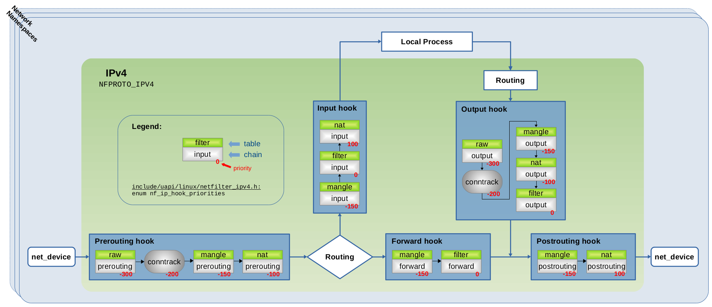

# NFTables:



### NFTables Modes:
- Script File
- Command-line
- Interactive mode


### NFTables:
```sh
# NFTables Examples:
/usr/share/doc/nftables/examples/
```
```sh
# NFTables Configuration file (Script file):
/etc/nftables.conf
```
```sh
nft -i # Interactive mode
nft list ruleset # List Rules
nft list ruleset # List Rules with priority numbers
nft -f /etc/nftables.conf # Load from configuration file
nft flush ruleset # Remove all rules
```
```sh
nft add table inet filter # Create filter table
nft add chain inet filter input # Create a chain under filter table named input.
nft add chain inet filter input { type filter hook input priority 0 \; } 
```
```sh
# Allow SSH for RFC1918(Private IP Address range):
nft add rule inet filter input ip saddr { 192.168.0.0/16, 172.16.0.0/12, 10.0.0.0/8 } tcp dport 22 accept
```
```sh
# Accept SSH & log it with specific prefix:
nft add rule inet filter input tcp dport 22 log prefix \"SSH CONNECTION: \" accept
```
```sh
# Remove NFTable Tables, Chains, Rules, ...
nft -a list ruleset # Display with handle numbers
nft delete rule inet filter input handle 9 # Delete a rule with handle number
```


